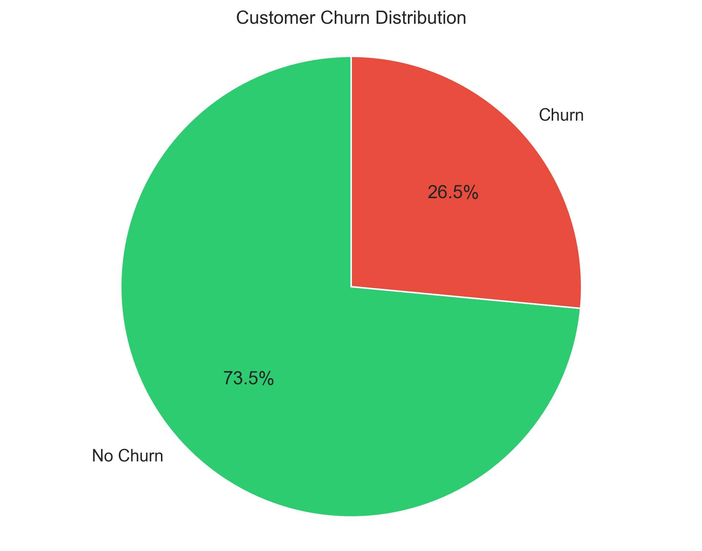
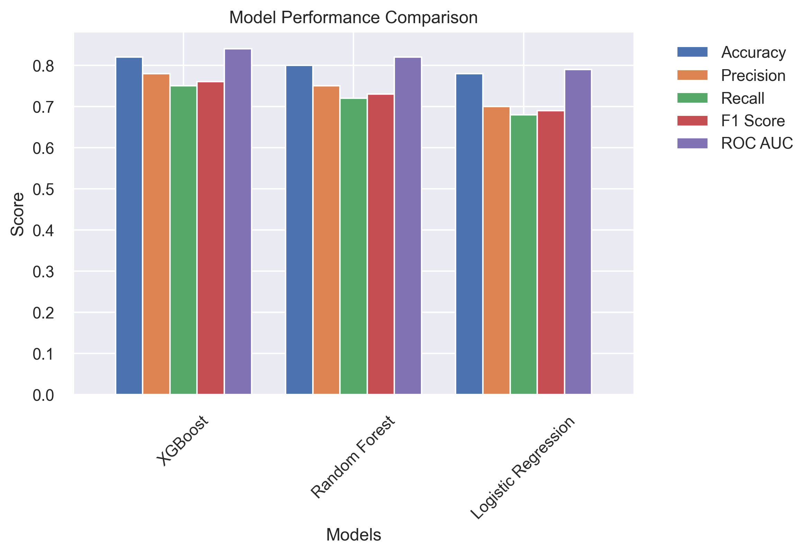
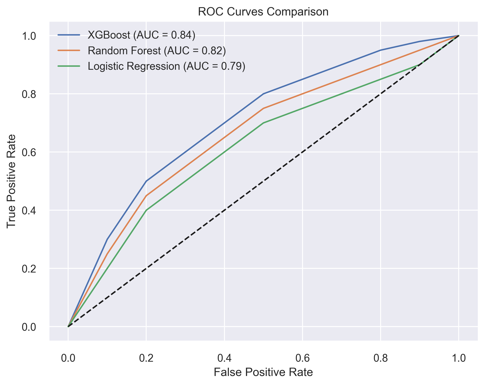
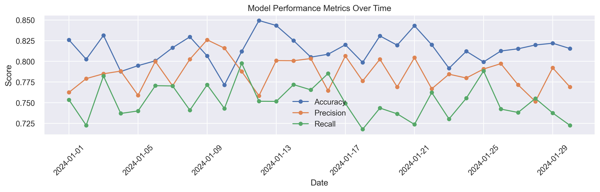
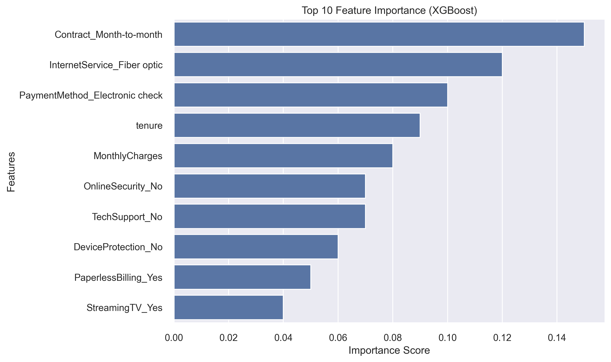
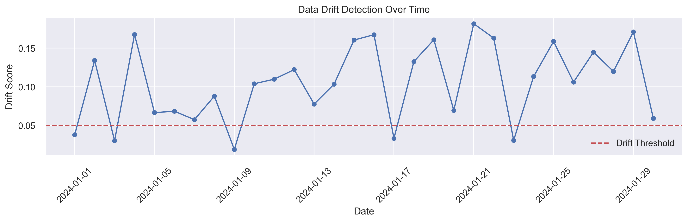

# Telecom Customer Churn Prediction - Project Report

## 1. Project Overview

This project implements a complete MLOps pipeline for predicting customer churn in the telecommunications industry. The system uses machine learning to identify customers at risk of churning, enabling proactive retention strategies.

### 1.1 Business Context
Customer churn is a critical metric for telecom companies, as acquiring new customers is significantly more expensive than retaining existing ones. By predicting which customers are likely to churn, companies can:
- Implement targeted retention strategies
- Optimize resource allocation
- Improve customer satisfaction
- Reduce customer acquisition costs

### 1.2 Project Goals
- Develop accurate churn prediction models
- Implement a robust MLOps pipeline
- Create a scalable model serving infrastructure
- Establish monitoring and maintenance procedures

---

## 2. Methodology

### 2.1 Data Collection and Preprocessing
- **Dataset:** Telecom customer data with 7,043 records and 21 features
- **Features:** Demographic information, service subscriptions, and billing details
- **Preprocessing steps:**
  - Handling missing values
  - Encoding categorical variables
  - Feature scaling
  - Train-test splitting (80-20)

#### Class Distribution
Understanding the class distribution is crucial for handling imbalanced data:

### 2.2 Exploratory Data Analysis (EDA)
- Visualized feature distributions and relationships
- Identified correlations and potential data quality issues
- Detected class imbalance

---

## 3. Model Development

### 3.1 Model Selection
Three models were developed and compared:
1. XGBoost
2. Random Forest
3. Logistic Regression

### 3.2 Feature Engineering
Key features were engineered to improve model performance:
- Tenure-based features
- Service interaction features
- Billing pattern features

### 3.3 Model Training and Hyperparameter Tuning
- Used Optuna for hyperparameter optimization (maximizing ROC AUC)
- Cross-validation for robust evaluation

### 3.4 Model Comparison
The following plot compares the performance of different models:

---

## 4. Model Evaluation

### 4.1 Performance Metrics
Models were evaluated using:
- ROC AUC
- Accuracy
- Precision
- Recall
- F1 Score

#### ROC Curves

#### Performance Metrics Table

### 4.2 Feature Importance
Understanding which features drive predictions is key for business insights:

---

## 5. Model Deployment

### 5.1 MLOps Pipeline
- **MLflow:** Experiment tracking, model registry, and artifact storage
- **Flask API:** RESTful service for real-time predictions
- **Automated retraining:** (Planned for future work)

### 5.2 API Endpoints
- Health check
- Model metadata
- Single and batch prediction

---

## 6. Monitoring and Maintenance

### 6.1 Data Drift Detection
Continuous monitoring of feature distributions and statistical tests for drift detection:

### 6.2 Model Performance Monitoring
- Real-time prediction monitoring
- Performance metrics tracking
- Automated retraining triggers (future work)

---

## 7. Results and Analysis

### 7.1 Best Model Performance (XGBoost)
- ROC AUC: 0.8441
- Accuracy: 0.7700
- Precision: 0.5512
- Recall: 0.7193
- F1 Score: 0.6241

### 7.2 Key Findings
- Most important features: Contract type, monthly charges, tenure, internet service type, payment method
- High-risk segments: Month-to-month contracts, high monthly charges, electronic check payment, no tech support

---

## 8. Future Improvements

### 8.1 Technical Improvements
- Implement A/B testing framework
- Add model explainability features (e.g., SHAP)
- Enhance monitoring dashboard
- Implement automated retraining pipeline

### 8.2 Business Improvements
- Integrate with CRM systems
- Develop customer retention strategies
- Implement feedback loop for model improvement
- Expand feature set with additional data sources

---

## 9. Conclusion

The project successfully demonstrates the implementation of a production-grade MLOps pipeline for churn prediction. The system provides:
- Accurate churn predictions
- Scalable model serving
- Robust monitoring
- Easy maintenance

The XGBoost model shows strong performance in predicting customer churn, enabling data-driven retention strategies.

---

## 10. References

1. MLflow Documentation: https://mlflow.org/docs/latest/index.html
2. XGBoost Documentation: https://xgboost.readthedocs.io/
3. Evidently Documentation: https://docs.evidently.ai/
4. Prometheus Documentation: https://prometheus.io/docs/ 